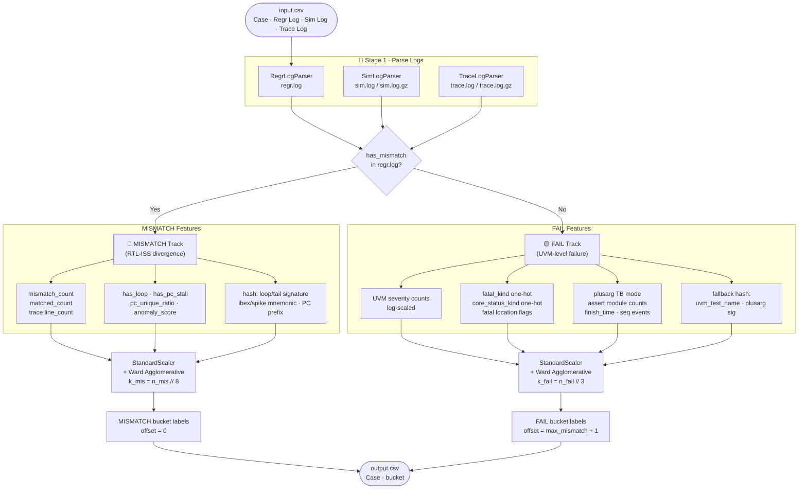

# 🔬 SoCV Final Project — 2026 CAD Contest B
# Regression Failure Bucketing

> **Automatically group failing UVM regression tests by their root-cause bug**
> using a split-track feature extraction and agglomerative clustering pipeline.

---

## 👥 Team Information

| Field | Info |
|-------|------|
| Team ID | `cadb1053` |
| Team Name | `bububusc` |

| Name | Student ID | E-mail | Alt. Contact |
|------|-----------|--------|-------------|
| 郭祐嘉 | B11901047 | `TBD` | `TBD` |
| 張庭碩 | B11901043 | `TBD` | `TBD` |
| 卜紹秦 | B11901112 | `TBD` | `TBD` |

> **Please fill in the `TBD` fields before final submission.**

---

## 🚀 Quick Start

### 1. Environment Setup

```bash
python3 -m venv .venv
source .venv/bin/activate
pip install -r requirements.txt
```

### 2. Run Bucketing

```bash
python src/regr_fail_bucketing.py \
  --input  B_samples_20260516/problem/benchmark_set_1/input.csv \
  --output output_set1.csv \
  --k 8 --verbose
```

### 3. Evaluate

```bash
python eval.py \
  --output output_set1.csv \
  --golden B_samples_20260516/problem/benchmark_set_1/golden.csv
```

### 4. Reproduce Public Benchmark Numbers

```bash
# benchmark_set_1
python src/regr_fail_bucketing.py \
  --input  B_samples_20260516/problem/benchmark_set_1/input.csv \
  --output /tmp/s1.csv --k 8
python eval.py --output /tmp/s1.csv \
  --golden B_samples_20260516/problem/benchmark_set_1/golden.csv

# benchmark_set_2
python src/regr_fail_bucketing.py \
  --input  B_samples_20260516/problem/benchmark_set_2/input.csv \
  --output /tmp/s2.csv --k 8
python eval.py --output /tmp/s2.csv \
  --golden B_samples_20260516/problem/benchmark_set_2/golden.csv
```

---

## 🏗️ Full Pipeline Workflow



---

## 🧠 Algorithm Description

### Pseudo Code

```text
INPUT:  input.csv
OUTPUT: output.csv  (Case → bucket)

───────────────────────────────────────────────
Stage 1: Parse all three log files per case
───────────────────────────────────────────────
for each case in input_csv:
    regr  = RegrLogParser.parse(regr.log)
    sim   = SimLogParser.parse(sim.log.gz)
    trace = TraceLogParser.parse(trace.log.gz)

───────────────────────────────────────────────
Stage 2: Split into MISMATCH / FAIL tracks
───────────────────────────────────────────────
mismatch_idx = { i | regr[i].has_mismatch }
fail_idx     = { i | NOT regr[i].has_mismatch }

───────────────────────────────────────────────
Stage 3: Cluster each track independently
───────────────────────────────────────────────
for track ∈ { MISMATCH, FAIL }:
    X      = build_features(cases[track], track)     # see Q1 / Q2
    X_norm = StandardScaler().fit_transform(X)
    k      = min(user_k, n, max(1, n // density(track)))
                                 # density: MISMATCH=8, FAIL=3
    labels = AgglomerativeClustering(
                 n_clusters = k,
                 linkage    = "ward"
             ).fit_predict(X_norm)
    assign global bucket = offset + labels
    offset += k

write output.csv
```

---

## ✨ Feature Engineering Details

### Q1 — FAIL Track Features

Cases end up here when `regr.log` has **no RTL-ISS mismatch** — the test failed at the UVM / testbench level.

```
┌─────────────────────────────────────────────────────────────────┐
│ Group A · UVM Severity Profile (4 dims, log1p scaled)           │
│   uvm_info_count · uvm_warning_count                            │
│   uvm_error_count · uvm_fatal_count                             │
├─────────────────────────────────────────────────────────────────┤
│ Group B · Fatal Semantics (weight ×2.0)                         │
│   fatal_kind  one-hot  (18 categories)                          │
│     NONE | WALL_CLOCK_TIMEOUT | TEST_TIMEOUT                    │
│     CORE_STATUS_TIMEOUT | CSR_TIMEOUT                           │
│     HANDSHAKE_FAIL | HANDSHAKE_MALFORMED | SIG_FORMAT_BAD       │
│     PRIV_MODE_CHECK | MCAUSE_CHECK | SIGNATURE_CHECK            │
│     DRET_CHECK | HDL_READ_FAIL | DOUBLE_FAULT                   │
│     CONFIG_MISSING | BIN_OPEN_FAIL | COSIM_MISMATCH             │
│     OTHER_FATAL                                                 │
│   core_status_kind  one-hot  (weight ×1.5)                      │
│     NONE | INITIALIZED | IN_DEBUG_MODE | HANDLING_IRQ           │
│     EBREAK_TAKEN | HANDLING_EXCEPTION | FINISHED_DIR_INSTR      │
│     OTHER                                                       │
│   fatal location flags (3 dims)                                 │
│     base_test.sv | test_lib.sv | cosim_scoreboard               │
├─────────────────────────────────────────────────────────────────┤
│ Group C · Testbench Mode (4 dims, from plusargs)                │
│   enable_debug_seq | enable_irq_single_seq                      │
│   enable_irq_multiple_seq | has_max_interval                    │
├─────────────────────────────────────────────────────────────────┤
│ Group D · Assertion Module Distribution (5 dims, log scaled)    │
│   cs_registers_i | id_stage_i | load_store_unit_i               │
│   controller_i | other                                          │
├─────────────────────────────────────────────────────────────────┤
│ Group E · Run Magnitude & Progression (6 + 4 dims)              │
│   log1p(finish_time) | log1p(assert_count)                      │
│   log1p(total_seq_events)                                       │
│   log1p(irq_raise) | log1p(irq_drop) | log1p(debug_seq)        │
│   reached_test_done | assert_storm(>5) | has_warning            │
│   has_simulator_error                                           │
├─────────────────────────────────────────────────────────────────┤
│ Group F · Fallback Hash (16 dims, weight ×0.4)                  │
│   MD5-hash(uvm_test_name) [8 dims]                              │
│   MD5-hash(plusarg_signature) [8 dims]                          │
└─────────────────────────────────────────────────────────────────┘
```

### Q2 — MISMATCH Track Features

Cases end up here when `regr.log` shows an **RTL-ISS (ibex vs Spike) divergence**.

```
┌─────────────────────────────────────────────────────────────────┐
│ Group A · Divergence Counts (3 dims, log1p scaled)              │
│   mismatch_count | matched_count | trace line_count             │
├─────────────────────────────────────────────────────────────────┤
│ Group B · Trace Behavior (4 dims)                               │
│   has_loop | has_pc_stall | pc_unique_ratio | anomaly_score     │
├─────────────────────────────────────────────────────────────────┤
│ Group C · Execution Fingerprint (hash, high weight)             │
│   loop_signature [28 dims, ×2.0]                                │
│   tail_signature [20 dims]                                      │
│   ibex_mnemonic  [12 dims]                                      │
│   spike_mnemonic [12 dims]                                      │
│   ibex_pc prefix [8 dims]                                       │
│   spike_pc prefix [8 dims]                                      │
└─────────────────────────────────────────────────────────────────┘
```

### Q3 — Choosing k for Each Track

k is computed **per track** with a density heuristic, capped by the user's `--k` argument:

```
k_track = min(user_k, n_track, max(1, n_track // density(track)))

  density(MISMATCH) = 8   ← many cases per bug, stay coarser
  density(FAIL)     = 3   ← fewer cases per bug, stay finer
```

| Scenario | n_mismatch | k_mismatch | n_fail | k_fail |
|----------|-----------|-----------|--------|--------|
| benchmark_set_1 | 1 | 1 | 8 | 2 |
| benchmark_set_2 | 17 | 2 | 10 | 3 |

**Why density-based?**  
Mismatch cases sharing a single cosim divergence point tend to cluster tightly — forcing too many buckets over-splits them. Fail cases have more diverse UVM signatures per bug and benefit from finer splitting.

---

## 🔑 Key Research Contributions

| # | Contribution | Description |
|---|-------------|-------------|
| 1 | **Split-track architecture** | Separates RTL-divergence cases from UVM-level failures before clustering, so each track uses purpose-built features. |
| 2 | **UVM-aware FAIL features** | 18-category fatal_kind one-hot + core_status + plusarg mode + assert-module distribution, covering all known ibex testbench failure families. |
| 3 | **Parser upgrades** | Handles compressed (`.gz`) and plain logs; extracts sequence event counts, finish time, plusarg signatures. |
| 4 | **Track-specific k heuristic** | Prevents over-fragmentation in dense MISMATCH clusters while keeping finer granularity for diverse FAIL cases. |

---

## ⚠️ Prior Work / Non-Contributions Disclosure

The following are **not** claimed as original contributions:

| Category | Items |
|----------|-------|
| Contest assets | Problem statement, datasets, sample solutions, official `eval.py` |
| 3rd-party packages | `numpy`, `pandas`, `scikit-learn` (AgglomerativeClustering, StandardScaler) |
| Domain knowledge | UVM reporting mechanism spec (IEEE 1800.2), ibex regression failure templates from public GitHub issues (lowRISC/ibex#2187) |
| Pre-semester baseline | Existing repo structure and baseline parsing code before this project |

---

## 🔧 Noticeable Implementation Details

- **Compressed log support** — all parsers handle both `.log` and `.log.gz` transparently.
- **One-hot vs hash** — fatal_kind and core_status use exact one-hot to avoid hash collision; only unseen-template fallback uses MD5 hash with low weight (×0.4).
- **Streaming tail read** — `trace.log` files can be millions of lines; only the last 60 lines are streamed via `deque(maxlen=60)` to stay efficient.
- **Feature standardization** — `StandardScaler` is applied per track before Ward clustering.
- **No global k** — `--k` is a cap, not a fixed target; actual k is derived from per-track density.

---

## 📊 Experimental Results

### Public Benchmark (with `--k 8`)

| Benchmark | # Cases | # Bugs | Balanced Accuracy |
|-----------|---------|--------|------------------|
| `benchmark_set_1` | 9 | 2 | **0.5500** |
| `benchmark_set_2` | 27 | 5 | **0.8987** |

### Feature Ablation Notes

- set_1 ceiling is at ~0.55: cases 5, 7, 9 share identical log content (same test, different seed) but belong to different bugs — no log-level feature can separate them.
- set_2 mismatch track (17 cases → 2 buckets) contributes most of the score gain; fail track (10 cases → 3 buckets) is separated primarily by `fatal_kind` and `testbench_mode`.

---

## 📁 Repository Structure

```
src/
├── regr_fail_bucketing.py   # entry point & CLI
├── log_parser.py            # RegrLogParser · SimLogParser · TraceLogParser
├── split_track_bucketing.py # SplitTrackBucketer (feature build + cluster)
├── feature_extractor.py     # (legacy, not used in main pipeline)
└── clustering.py            # (legacy, not used in main pipeline)
requirements.txt
eval.py                      # provided evaluation script
```
